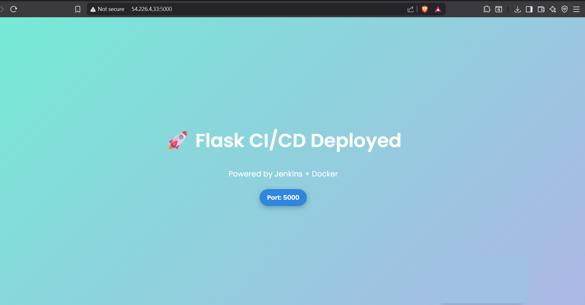
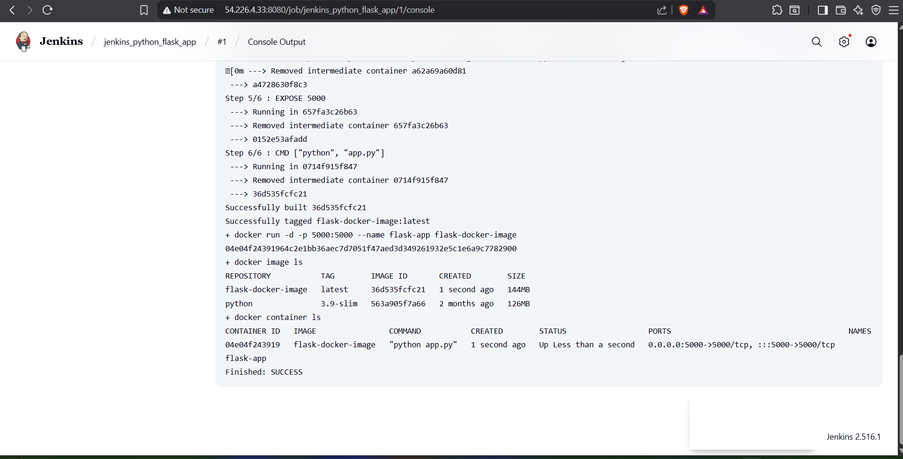
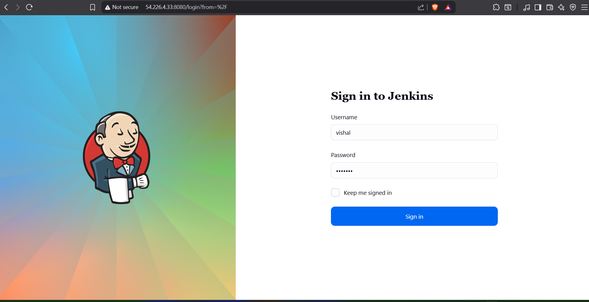
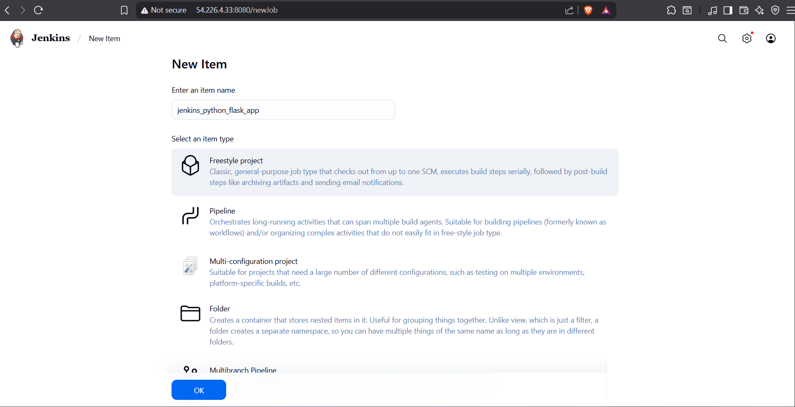
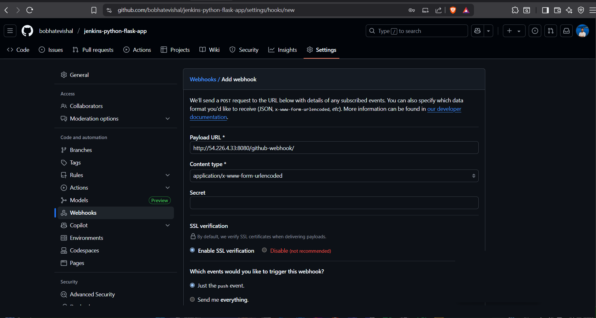
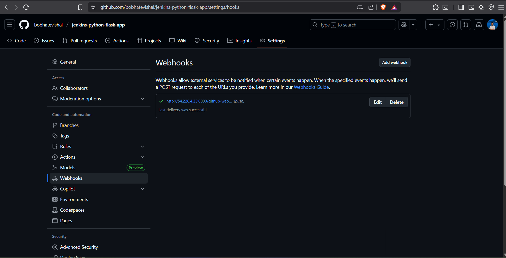

````markdown
# 🚀 CI/CD Flask App with Jenkins + Docker + GitHub Webhooks

This project demonstrates a complete **CI/CD ** built using **Jenkins**, **Docker**, and **GitHub Webhooks** to automatically build and deploy a Flask web application. The entire pipeline runs on an **Ubuntu EC2 instance**, and the deployed Flask app is accessible publicly on port 5000.

---

## 🌟 Final Output



🔗 **Live App**: http://<your-ec2-ip>:5000  
🔗 **GitHub Repo**: https://github.com/bobhatevishal/jenkins-python-flask-app

---

## 📁 Project Structure

```bash
├── app.py              # Flask application
├── Dockerfile          # Docker build instructions
├── requirements.txt    # Python dependencies
````

---

## 💡 Tech Stack

| Tool/Service       | Purpose                                  |
| ------------------ | ---------------------------------------- |
| **Python (Flask)** | Web Application                          |
| **Docker**         | Containerization                         |
| **Jenkins**        | CI/CD Automation                         |
| **GitHub**         | Source Code Management & Webhook Trigger |
| **AWS EC2**        | Server for Jenkins and app hosting       |

---

## ⚙️ Step-by-Step Setup Guide

### 🧱 1. Install Java and Jenkins on EC2

```bash
sudo apt update
sudo apt install openjdk-11-jdk -y
```

Add Jenkins repository:

```bash
curl -fsSL https://pkg.jenkins.io/debian-stable/jenkins.io.key | sudo tee \
  /usr/share/keyrings/jenkins-keyring.asc > /dev/null

echo deb [signed-by=/usr/share/keyrings/jenkins-keyring.asc] \
  https://pkg.jenkins.io/debian-stable binary/ | sudo tee \
  /etc/apt/sources.list.d/jenkins.list > /dev/null

sudo apt update
sudo apt install jenkins -y
```

Start Jenkins:

```bash
sudo systemctl start jenkins
sudo systemctl enable jenkins
```

Access Jenkins at:

```
http://<EC2-Public-IP>:8080
```

---

### 🔐 2. Unlock Jenkins

```bash
sudo cat /var/lib/jenkins/secrets/initialAdminPassword
```

Use the password to complete Jenkins setup in the browser and install **suggested plugins**.

---

### 🧑‍💻 3. Push Flask App to GitHub

Create a GitHub repository (e.g. `jenkins-python-flask-app`) and push the following files:

* `app.py`
* `Dockerfile`
* `requirements.txt`

---

### 🌐 4. Set Up GitHub Webhook

Navigate to:
**GitHub → Repo → Settings → Webhooks → Add Webhook**

Fill the fields:

* **Payload URL**: `http://<your-ec2-ip>:8080/github-webhook/`
* **Content-Type**: `application/x-www-form-urlencoded`
* ✅ Trigger: "Just the push event"

---

### 🛠️ 5. Configure Jenkins Job (Freestyle)

1. Go to Jenkins → **New Item**
2. Select **Freestyle project**
3. Name it: `jenkins_python_flask_app`

#### Under **Source Code Management → Git**

```
Repository URL: https://github.com/bobhatevishal/jenkins-python-flask-app.git
Branch: */main
```

#### Under **Build Triggers**

✅ Tick: **GitHub hook trigger for GITScm polling**

#### Under **Build → Execute Shell**, paste:

```bash
docker rm -f flask-app || true
docker rmi flask-docker-image || true
docker build -t flask-docker-image .
docker run -d -p 5000:5000 --name flask-app flask-docker-image
docker image ls
```

---

## 🖼️ Screenshot Gallery

| 📸 Description             | Preview                                 |
| -------------------------- | --------------------------------------- |
| Jenkins Job Console Output |  |
| Shell Script Execution     |                 |
| Jenkins Login Page         |       |
| Jenkins Project Setup      |   |
| Web App Running            |                   |
| GitHub Webhook Setup       |                |
| Webhook Delivery Success   |      |

---

## 🔍 What I Learned

* 🔁 How to create a complete CI/CD  using Jenkins & GitHub
* 🐳 Docker container lifecycle automation with Jenkins
* 🧠 Webhook-based automatic deployment on every Git push
* 🧰 Debugging Jenkins errors and Docker port issues
* 🚀 Running a live Flask app in Docker from Jenkins

---

## 👤 About Me

**Vishal Bobhate**
📌 DevOps & Cloud Enthusiast 
🔗 [GitHub Profile](https://github.com/bobhatevishal)
📫 Email: [bobhatev13@gmail.com](mailto:bobhatev13@gmail.com)

---

## 📣 Feel Free to Fork & Try!

> ⭐ If you like this project, give it a star on GitHub!

---
